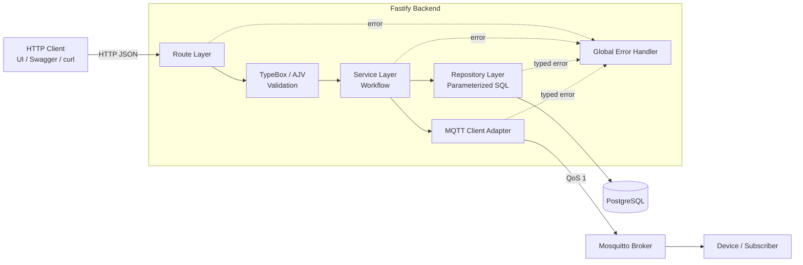
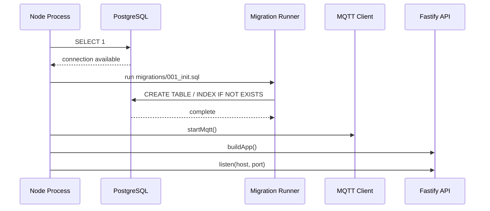
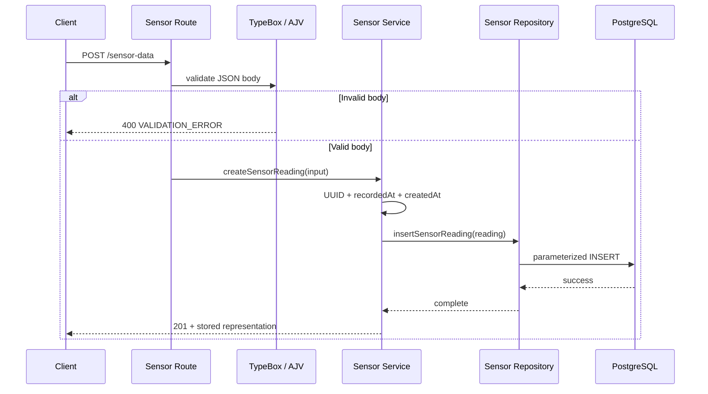
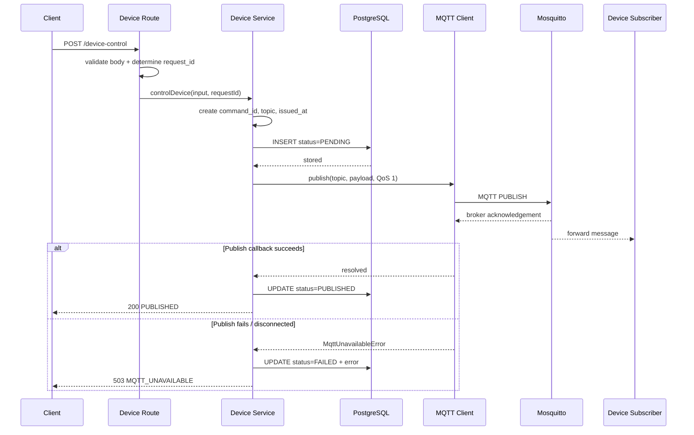
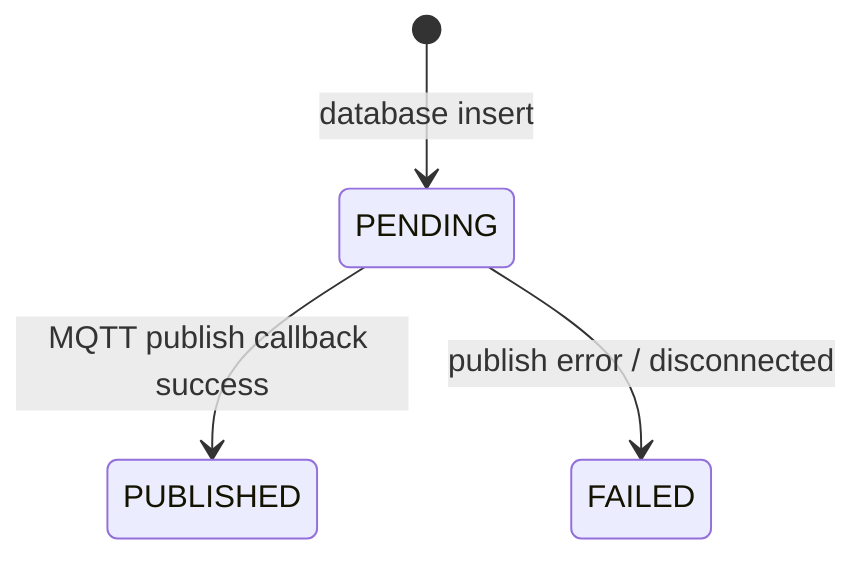
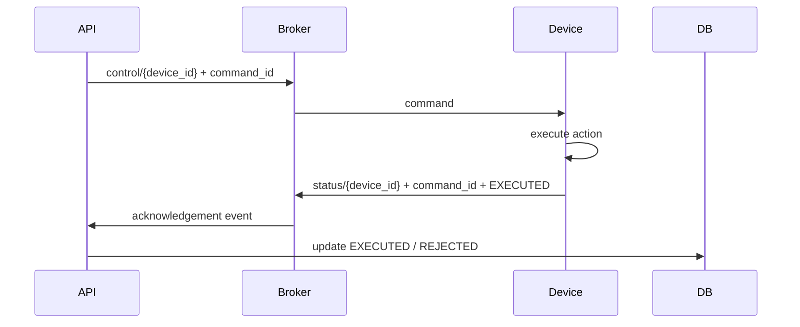
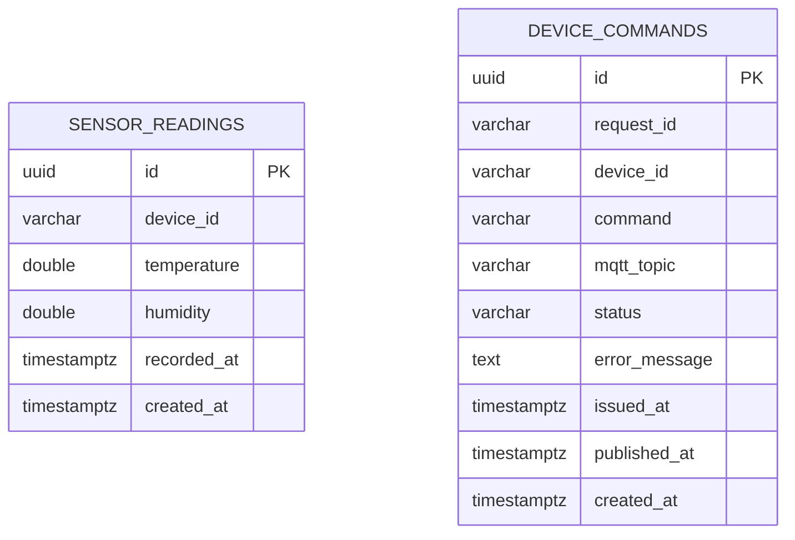
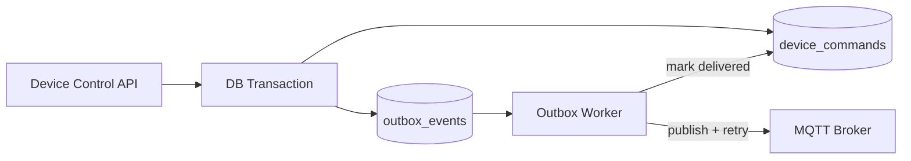
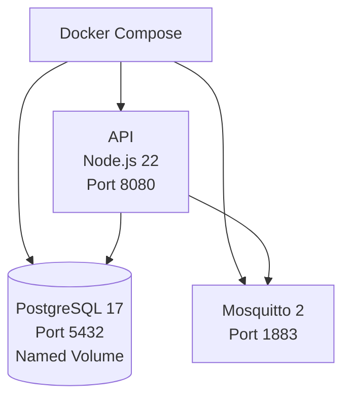

# Design Explanation — Smart Greenhouse Backend

## 1. Ringkasan Dokumen

Dokumen ini menjelaskan desain Smart Greenhouse Backend dari sudut pandang kebutuhan, arsitektur, aliran data, penyimpanan, integrasi MQTT, keamanan, reliability, testing, dan kesiapan produksi.

Seluruh penjelasan didasarkan pada implementasi yang tersedia di repository. Fitur yang belum ada akan disebut sebagai batasan atau rencana pengembangan, bukan sebagai kemampuan yang sudah selesai.

> **Catatan scope:** `assignment.md` dan `jobdesc.md` tidak tersedia di repository ketika analisis dilakukan. Karena itu, requirement pada dokumen ini disimpulkan dari `README.md`, source code, migration, konfigurasi Docker, dan integration test.

---

## 2. Konteks dan Masalah yang Diselesaikan

Sebuah sistem greenhouse membutuhkan backend yang dapat menangani dua jenis interaksi berbeda:

1. **Sensor ingestion** — menerima data suhu dan kelembapan untuk disimpan sebagai histori.
2. **Device control** — menerima instruksi dari client, lalu mengirim command ke perangkat seperti kipas atau aktuator.

Kedua kebutuhan tersebut memiliki karakter yang berbeda:

| Kebutuhan            | Karakteristik                                                                                         |
| -------------------- | ----------------------------------------------------------------------------------------------------- |
| Sensor ingestion     | Data berbentuk event, perlu divalidasi dan disimpan secara durable.                                   |
| Device control       | Membutuhkan komunikasi cepat ke perangkat dan status pengiriman yang dapat dilacak.                   |
| Client integration   | Lebih mudah menggunakan HTTP/JSON yang umum dan terdokumentasi.                                       |
| Device communication | Membutuhkan protokol ringan dan tidak mengharuskan koneksi langsung dari backend ke setiap perangkat. |

Desain project memecahkan masalah tersebut dengan membagi protokol berdasarkan fungsi:

- **REST API** digunakan sebagai interface antara client dan backend.
- **PostgreSQL** digunakan sebagai penyimpanan durable untuk reading dan command history.
- **MQTT** digunakan untuk meneruskan command dari backend ke perangkat.

Backend berfungsi sebagai **validation boundary**, **workflow coordinator**, dan **audit boundary**. Client tidak mengirim pesan secara langsung ke broker MQTT, sehingga aturan input dan pencatatan command tetap dikendalikan oleh backend.

---

## 3. Tujuan Desain

Desain project memprioritaskan hal-hal berikut:

### 3.1 Correctness

Input yang tidak lengkap, salah tipe, di luar batas, atau berpotensi mengubah struktur topic harus ditolak sebelum diproses.

### 3.2 Auditability

Sensor reading dan device command harus memiliki ID serta timestamp. Device command disimpan sebelum publish agar command yang gagal tetap meninggalkan jejak.

### 3.3 Separation of Concerns

HTTP handling, validation, business workflow, persistence, dan komunikasi MQTT dipisahkan ke modul yang berbeda.

### 3.4 Predictable Failure Handling

Client menerima struktur error yang konsisten. Detail internal disimpan di log dan tidak dibocorkan melalui response dependency error.

### 3.5 Reproducible Development

API, database, dan broker dapat dijalankan sebagai satu environment lokal melalui Docker Compose tanpa membutuhkan perangkat fisik.

### 3.6 Honest Operational State

Endpoint health tidak hanya memeriksa apakah process API hidup, tetapi juga melakukan query database dan memeriksa status koneksi MQTT.

---

## 4. Technology Stack dan Alasan Penggunaan

| Teknologi       | Peran               | Alasan desain                                                                                          |
| --------------- | ------------------- | ------------------------------------------------------------------------------------------------------ |
| Node.js 22      | Runtime backend     | Cocok untuk HTTP dan komunikasi I/O asynchronous seperti database dan MQTT.                            |
| TypeScript      | Bahasa aplikasi     | Strict typing membantu mendeteksi kesalahan kontrak dan optional value saat development.               |
| Fastify 5       | HTTP framework      | Mendukung schema validation, plugin lifecycle, logging, body limit, dan error handler terpusat.        |
| TypeBox + AJV   | Request schema      | Satu schema dapat dipakai untuk type inference, runtime validation, dan dokumentasi OpenAPI.           |
| PostgreSQL 17   | Durable storage     | Mendukung constraint, indexing, timestamp timezone-aware, dan transaksi untuk pengembangan berikutnya. |
| MQTT.js         | MQTT client         | Menyediakan publish callback, QoS, timeout, reconnect, dan lifecycle koneksi.                          |
| Mosquitto 2     | Local MQTT broker   | Broker ringan dan mudah dijalankan melalui container untuk development serta integration test.         |
| Swagger/OpenAPI | Dokumentasi API     | Membuat kontrak request dapat dipelajari dan diuji secara interaktif.                                  |
| Vitest          | Test runner         | Menjalankan integration test TypeScript dengan konfigurasi sederhana.                                  |
| Docker          | Packaging           | Menjaga runtime API konsisten dan memisahkan build dependency dari production dependency.              |
| Docker Compose  | Local orchestration | Menjalankan API, PostgreSQL, dan Mosquitto beserta health dependency dalam satu perintah.              |

---

## 5. Gambaran Arsitektur

Project menggunakan **layered modular monolith**. Seluruh fungsi backend berjalan sebagai satu service, tetapi source code dipisahkan berdasarkan tanggung jawab.



### Mengapa modular monolith?

Scope project memiliki tiga endpoint operasional dan dua dependency eksternal. Memecahnya menjadi microservices akan menambah deployment, network failure, tracing, dan data consistency complexity tanpa memberikan manfaat yang sebanding.

Modular monolith memberikan boundary source code yang jelas, tetapi tetap sederhana untuk:

- dijalankan secara lokal;
- diuji end-to-end;
- dibangun sebagai satu image;
- dipahami oleh engineer baru;
- dikembangkan menjadi service terpisah bila skalanya benar-benar membutuhkan.

---

## 6. Struktur Source Code

```text
src/
├── app.ts                      Fastify setup dan plugin registration
├── server.ts                   startup, migration, listen, shutdown
├── config/
│   └── env.ts                  environment parsing dan validation
├── db/
│   ├── pool.ts                 PostgreSQL connection pool
│   ├── migrate.ts              menjalankan migration SQL
│   └── errors.ts               typed database error
├── mqtt/
│   └── client.ts               connect, publish, state, shutdown
├── plugins/
│   └── error-handler.ts        centralized error translation
└── modules/
    ├── sensor/                 schema, route, service, repository
    ├── device/                 schema, route, service, repository
    └── health/                 route dan dependency health check
```

Pola internal pada module utama adalah:

```text
Route → Schema Validation → Service → Repository / External Adapter
```

### Tanggung jawab masing-masing layer

#### Route

- Mendefinisikan method dan URL.
- Menghubungkan request schema.
- Mengambil metadata HTTP seperti `x-request-id`.
- Memilih HTTP status untuk response sukses.
- Tidak menulis SQL dan tidak membentuk koneksi MQTT.

#### Schema

- Mendefinisikan field wajib dan optional.
- Menentukan tipe, enum, range, pattern, dan larangan field tambahan.
- Menjadi runtime validation serta sumber OpenAPI request documentation.

#### Service

- Mengatur workflow bisnis.
- Membuat UUID dan timestamp.
- Membentuk MQTT topic dan payload.
- Menentukan urutan persist dan publish.

#### Repository

- Menjalankan query SQL parameterized.
- Memetakan input service ke kolom database.
- Mengubah error driver menjadi error aplikasi yang stabil.

#### External adapter

- Mengisolasi lifecycle dan operasi MQTT.
- Menyediakan status koneksi untuk health check.
- Mengubah kegagalan publish menjadi `MqttUnavailableError`.

---

## 7. Application Lifecycle

### 7.1 Startup

Urutan startup pada `src/server.ts` adalah:



Database diperiksa sebelum server menerima traffic. Bila koneksi atau migration gagal, process berhenti dengan exit code 1. Ini mencegah API terlihat siap padahal dependency penyimpanan belum tersedia.

Koneksi MQTT dimulai sebelum listen, tetapi proses koneksinya asynchronous. Karena itu, API dapat mulai hidup saat MQTT masih menghubungkan diri. Endpoint `/status` akan mengembalikan unhealthy sampai MQTT benar-benar connected.

### 7.2 Graceful Shutdown

Ketika menerima `SIGINT` atau `SIGTERM`, aplikasi:

1. menutup Fastify agar tidak menerima request baru;
2. menghentikan MQTT client;
3. mengakhiri PostgreSQL pool;
4. keluar dengan status sukses.

Desain ini mengurangi risiko koneksi dibiarkan terbuka ketika container dihentikan atau deployment diganti.

### Improvement lifecycle

Untuk production, shutdown dapat diperkuat dengan:

- guard agar signal kedua tidak memulai shutdown paralel;
- maximum shutdown timeout;
- readiness state yang berubah menjadi false sebelum connection draining;
- separate migration job agar beberapa replica tidak menjalankan migration bersamaan.

---

## 8. Sensor Ingestion Design

### 8.1 Endpoint

```http
POST /sensor-data
Content-Type: application/json
```

Contoh request:

```json
{
  "device_id": "sensor-zone-1",
  "temperature": 27.5,
  "humidity": 68.2,
  "recorded_at": "2026-09-20T10:00:00.000Z"
}
```

`recorded_at` bersifat optional. Bila tidak dikirim, service memakai waktu saat request diproses.

### 8.2 Flow



### 8.3 Event time dan ingestion time

Data sensor menyimpan dua waktu:

| Field         | Makna                                                 |
| ------------- | ----------------------------------------------------- |
| `recorded_at` | Waktu reading dicatat oleh pengirim atau waktu event. |
| `created_at`  | Waktu backend membuat record atau ingestion time.     |

Pemisahan ini penting karena perangkat dapat terlambat mengirim data, melakukan buffering, atau replay. Dengan dua timestamp, sistem di masa depan dapat menghitung ingestion delay dan mengurutkan data berdasarkan waktu kejadian.

### 8.4 Duplicate reading

Project memperlakukan setiap request valid sebagai event baru. Dua reading dengan device, temperature, dan humidity yang sama tetap disimpan sebagai dua record berbeda dengan UUID masing-masing.

Perilaku ini sesuai model event, tetapi belum menyediakan idempotency untuk retry network. Bila pengirim harus dapat retry tanpa duplikasi, diperlukan event ID dari perangkat atau idempotency key dengan unique constraint.

---

## 9. Device Control Design

### 9.1 Endpoint

```http
POST /device-control
Content-Type: application/json
```

Contoh request:

```json
{
  "device_id": "fan-zone-1",
  "command": "ON"
}
```

### 9.2 Mengapa intent disimpan sebelum publish?

Command menimbulkan external side effect. Bila backend langsung publish dan broker gagal, tidak ada catatan bahwa user pernah meminta command tersebut.

Karena itu, workflow saat ini menggunakan pola berikut:

```text
Persist intent → Attempt publish → Persist outcome
```

Catatan `PENDING` dibuat sebelum publish. Hasil publish kemudian mengubah state menjadi `PUBLISHED` atau `FAILED`.

### 9.3 Sequence



### 9.4 Request ID dan Command ID

| ID           | Sumber                                               | Fungsi                                                                 |
| ------------ | ---------------------------------------------------- | ---------------------------------------------------------------------- |
| `request_id` | `x-request-id` maksimal 128 karakter, atau UUID baru | Membantu korelasi request HTTP dengan command.                         |
| `command_id` | UUID baru dari backend                               | Mengidentifikasi satu command individual di database dan payload MQTT. |

`request_id` saat ini **bukan idempotency key**. Mengirim request dua kali dengan request ID yang sama tetap membuat dua command ID dan dua publish.

### 9.5 State model



State tersebut menjelaskan status publish dari backend, bukan status eksekusi perangkat.

---

## 10. MQTT Design

### 10.1 Peran komponen

| Komponen              | Peran                                                        |
| --------------------- | ------------------------------------------------------------ |
| Backend               | Publisher command.                                           |
| Mosquitto             | Broker yang menerima dan meneruskan pesan berdasarkan topic. |
| Device atau simulator | Subscriber topic command.                                    |

Backend tidak menjadi subscriber pada implementasi saat ini.

### 10.2 Topic design

```text
greenhouse/control/{device_id}
```

Contoh:

```text
greenhouse/control/fan-zone-1
```

Prefix tetap memisahkan namespace greenhouse dan fungsi control. Suffix device membuat perangkat dapat subscribe hanya pada command yang relevan.

### 10.3 Payload design

```json
{
  "command_id": "uuid",
  "request_id": "http-correlation-id",
  "device_id": "fan-zone-1",
  "command": "ON",
  "issued_at": "2026-09-20T10:00:00.000Z"
}
```

Payload berisi identitas command, korelasi request, target, aksi, dan waktu penerbitan. `command_id` dapat menjadi dasar deduplication bila device logic dikembangkan lebih lanjut.

### 10.4 QoS 1

Publish menggunakan QoS 1, yang memberikan semantik **at least once** pada jalur MQTT. Broker memberikan acknowledgement kepada publisher, tetapi pesan dapat terkirim lebih dari satu kali.

Konsekuensinya:

- lebih reliable dibanding QoS 0;
- overhead lebih rendah dibanding QoS 2;
- consumer harus siap menerima pesan duplikat;
- acknowledgement broker bukan acknowledgement bahwa aktuator berhasil bekerja.

Untuk command `ON` dan `OFF` yang bersifat set-state, pemrosesan dapat dibuat idempotent. Device juga dapat menyimpan `command_id` terakhir yang sudah diproses untuk menolak duplikasi.

### 10.5 Retain false

Command diterbitkan dengan `retain: false`. Ini mencegah command lama disimpan sebagai retained message dan dikirim otomatis ketika perangkat baru terhubung kembali.

Keputusan ini penting karena command lama seperti `ON` mungkin tidak lagi aman atau relevan. Bila sistem membutuhkan desired state, sebaiknya dibuat topic state/configuration terpisah yang memang dirancang untuk retained message.

### 10.6 Connection behavior

Konfigurasi client:

| Pengaturan                 |                 Nilai | Tujuan                                               |
| -------------------------- | --------------------: | ---------------------------------------------------- |
| Clean session              |                `true` | Session MQTT tidak dipertahankan setelah disconnect. |
| Reconnect period           |               2 detik | Client mencoba menghubungkan diri kembali.           |
| Connect timeout            |               5 detik | Percobaan koneksi tidak menggantung tanpa batas.     |
| Optional username/password | Environment variables | Mendukung broker yang memerlukan credential.         |

Dengan clean session, desain tidak menyediakan offline queue persistent untuk backend atau subscriber. Ini cukup untuk local assignment, tetapi perlu ditinjau kembali bila guaranteed delivery ketika device offline menjadi requirement.

### 10.7 Topic injection prevention

`device_id` hanya menerima pola:

```regex
^[A-Za-z0-9][A-Za-z0-9._-]{0,127}$
```

Karakter berikut tidak dapat masuk ke device ID:

- `/` — pemisah level topic;
- `+` — single-level wildcard;
- `#` — multi-level wildcard.

Dengan demikian, client tidak dapat membentuk topic di luar namespace yang sudah ditentukan backend.

---

## 11. Real-Time Communication Boundary

Istilah “real-time” perlu digunakan secara tepat.

### Yang tersedia

- Backend mem-publish command segera setelah intent tersimpan.
- Broker meneruskan pesan ke subscriber yang sesuai.
- Health endpoint menampilkan state koneksi MQTT saat ini.

### Yang tidak tersedia

- WebSocket atau Server-Sent Events untuk browser/frontend.
- Subscription sensor inbound dari MQTT.
- Push sensor update dari backend ke dashboard.
- Acknowledgement dari device bahwa command diterima atau dieksekusi.

### Arti status PUBLISHED

```text
PUBLISHED = MQTT publish callback berhasil
PUBLISHED ≠ perangkat telah mengeksekusi command
```

Untuk memastikan eksekusi, desain dapat dikembangkan menjadi:



Diagram tersebut merupakan usulan pengembangan, bukan flow yang sudah diimplementasikan.

---

## 12. API Contract

### 12.1 Endpoint summary

| Method | Endpoint          | Tujuan                        | Sukses | Kegagalan utama         |
| ------ | ----------------- | ----------------------------- | -----: | ----------------------- |
| POST   | `/sensor-data`    | Menyimpan sensor reading      |    201 | 400, 413, 429, 503, 500 |
| POST   | `/device-control` | Menyimpan dan publish command |    200 | 400, 413, 429, 503, 500 |
| GET    | `/status`         | Memeriksa API, DB, dan MQTT   |    200 | 503                     |
| GET    | `/docs`           | Swagger UI                    |    200 | —                       |

### 12.2 Success response sensor

```json
{
  "success": true,
  "data": {
    "id": "uuid",
    "device_id": "sensor-zone-1",
    "temperature": 27.5,
    "humidity": 68.2,
    "recorded_at": "2026-09-20T10:00:00.000Z",
    "created_at": "2026-09-20T10:00:00.000Z"
  }
}
```

### 12.3 Success response command

```json
{
  "success": true,
  "data": {
    "id": "uuid",
    "device_id": "fan-zone-1",
    "command": "ON",
    "topic": "greenhouse/control/fan-zone-1",
    "status": "PUBLISHED",
    "published_at": "2026-09-20T10:00:00.000Z"
  },
  "request_id": "correlation-id"
}
```

### 12.4 Error envelope

```json
{
  "success": false,
  "error": {
    "code": "VALIDATION_ERROR",
    "message": "Request validation failed"
  }
}
```

Stable `error.code` memungkinkan client menentukan perilaku tanpa parsing teks message.

---

## 13. Validation Design

Validasi dilakukan berlapis.


### 13.1 API validation

| Field               | Rule                                                                                  |
| ------------------- | ------------------------------------------------------------------------------------- |
| `device_id`         | 1–128 karakter; alphanumeric pada awal; selanjutnya alphanumeric, `.`, `_`, atau `-`. |
| `temperature`       | Number antara -50 dan 100.                                                            |
| `humidity`          | Number antara 0 dan 100.                                                              |
| `recorded_at`       | Optional ISO 8601 date-time string.                                                   |
| `command`           | Hanya literal `ON` atau `OFF`.                                                        |
| Additional property | Ditolak.                                                                              |

Fastify dikonfigurasi dengan `coerceTypes: false`. Nilai string `"27.5"` tidak otomatis dianggap number. Ini membuat kontrak lebih eksplisit dan mencegah input ambigu.

### 13.2 Database validation

PostgreSQL mengulang constraint penting:

- format device ID pada sensor;
- temperature range;
- humidity range;
- command enum;
- command status enum.

API validation memberi error cepat dan mudah dimengerti. Database constraint menjaga integritas jika terjadi bug atau data ditulis dari jalur lain.

### 13.3 Resource protection

- Body limit: 1 MiB.
- Global rate limit: 100 request per menit per IP.
- Database pool maksimum: 10 connection.
- Database connection timeout: 5 detik.
- Idle connection timeout: 30 detik.

---

## 14. Error Handling Design

Error handler terpusat membedakan expected client errors, dependency errors, dan unexpected errors.

| Kondisi                         | HTTP | Error code             | Log level      |
| ------------------------------- | ---: | ---------------------- | -------------- |
| Schema validation gagal         |  400 | `VALIDATION_ERROR`     | warn           |
| JSON tidak valid                |  400 | `MALFORMED_JSON`       | warn           |
| Route tidak ada                 |  404 | `NOT_FOUND`            | handler khusus |
| Body > 1 MiB                    |  413 | `PAYLOAD_TOO_LARGE`    | warn           |
| Rate limit terlampaui           |  429 | `RATE_LIMIT_EXCEEDED`  | warn           |
| Database operation gagal        |  503 | `DATABASE_UNAVAILABLE` | error          |
| MQTT disconnected/publish gagal |  503 | `MQTT_UNAVAILABLE`     | error          |
| Error tidak dikenal             |  500 | `INTERNAL_ERROR`       | error          |

### Mengapa typed dependency error?

Repository tidak membiarkan route bergantung pada detail error PostgreSQL. Ia mengubah kegagalan menjadi `DatabaseOperationError`. MQTT module melakukan hal serupa dengan `MqttUnavailableError`.

Keuntungannya:

- response API stabil walaupun driver berubah;
- detail internal tidak dikirim ke client;
- error handler dapat menentukan status HTTP berdasarkan kategori dependency;
- log tetap menyimpan cause untuk diagnosis.

### Known error-handling edge case

Pada device workflow, catch block mencakup publish dan update status `PUBLISHED`. Akibatnya:

1. Jika MQTT publish berhasil tetapi update `PUBLISHED` gagal, catch mencoba menandai record sebagai `FAILED`.
2. Jika publish gagal lalu update `FAILED` juga gagal, error database dapat menutupi error MQTT awal.

Ini adalah konsekuensi dual write dan area yang layak direfactor. Solusi production yang lebih kuat dibahas pada bagian transactional outbox.

---

## 15. Database Design

### 15.1 Entity overview



Tidak ada relationship foreign key antara kedua tabel. Keduanya merekam jenis event yang berbeda dan hanya berbagi external identifier berupa `device_id`.

### 15.2 sensor_readings

Tabel ini bersifat append-oriented. Reading baru menghasilkan record baru, bukan update record sebelumnya.

Index:

```sql
(device_id, recorded_at DESC)
(recorded_at DESC)
```

Index pertama mendukung pola “reading terbaru untuk satu device”. Index kedua mendukung query time-range lintas device.

### 15.3 device_commands

Tabel ini menyimpan lifecycle command:

- intent awal;
- target device;
- exact MQTT topic;
- status publish;
- error singkat;
- waktu issue dan publish.

Penyimpanan exact topic membantu audit bila struktur topic berubah di masa depan.

### 15.4 Mengapa tidak ada device table?

Current scope memperlakukan `device_id` sebagai identifier eksternal. Keuntungannya adalah onboarding sederhana. Kekurangannya:

- backend tidak membuktikan device sudah terdaftar;
- tidak ada ownership;
- tidak ada status active/inactive;
- tidak ada capability validation;
- client dapat mengirim command ke identifier valid secara format tetapi tidak dikenal.

Production design sebaiknya menambahkan device registry sebelum menerapkan foreign key atau authorization per device.

### 15.5 Migration strategy

Saat startup, aplikasi membaca dan menjalankan `migrations/001_init.sql`. DDL memakai `IF NOT EXISTS`, sehingga aman dijalankan ulang untuk schema awal.

Keterbatasannya:

- tidak ada tabel migration history;
- tidak ada version ordering selain file yang di-hardcode;
- tidak ada rollback;
- beberapa replica dapat mencoba migration bersamaan;
- perubahan schema kompleks akan sulit dikelola.

Untuk production, gunakan migration tool/version ledger dan jalankan migration sebagai deployment step terpisah.

---

## 16. Health Check dan Observability

### 16.1 Health endpoint

`GET /status` memeriksa:

- process API dapat menangani request;
- PostgreSQL dapat menjawab `SELECT 1`;
- MQTT client berada dalam state connected.

Database latency diukur dalam millisecond.

Response sehat:

```json
{
  "status": "healthy",
  "service": { "status": "up" },
  "database": {
    "status": "up",
    "latency_ms": 1
  },
  "mqtt": {
    "status": "up",
    "connected": true
  },
  "timestamp": "2026-09-20T10:00:00.000Z"
}
```

Jika database atau MQTT tidak tersedia, endpoint mengembalikan 503.

### 16.2 Logging

Fastify logger menggunakan level yang dikonfigurasi melalui `LOG_LEVEL`. Request rejection yang diperkirakan dicatat sebagai warning; dependency atau unexpected failure dicatat sebagai error.

MQTT lifecycle saat ini menggunakan `console.info`, `console.warn`, dan `console.error`. Untuk consistency production, MQTT log sebaiknya menggunakan logger Fastify/Pino dengan structured fields seperti client ID, broker, event, dan correlation ID.

### 16.3 Observability gaps

Belum tersedia:

- metrics counter dan histogram;
- distributed tracing;
- centralized log transport;
- alerting;
- business metric seperti publish failure rate;
- queue lag atau pending command age.

---

## 17. Security Design

### 17.1 Kontrol yang sudah ada

- Strict request schema.
- Type coercion dimatikan.
- Additional field ditolak.
- MQTT topic injection dibatasi melalui device ID pattern.
- Parameterized SQL mencegah value dijadikan query syntax.
- Request body limit.
- Rate limiting.
- Dependency error tidak membocorkan detail internal.
- `.env` diabaikan oleh Git.
- MQTT credential dapat diberikan melalui environment variable.
- Production container berjalan sebagai user `node`, bukan root.

### 17.2 Batas keamanan saat ini

- Tidak ada authentication.
- Tidak ada authorization per endpoint atau per device.
- Mosquitto local mengaktifkan anonymous access.
- Mosquitto local tidak menggunakan TLS.
- Tidak ada broker ACL.
- Tidak ada secret manager atau rotation.
- Rate limit berada pada instance API, bukan shared store.
- Tidak ada network policy pada Docker Compose local.

### 17.3 Production security roadmap

Prioritas yang disarankan:

1. Tambahkan client identity melalui JWT/OAuth2/API key sesuai use case.
2. Terapkan authorization agar user hanya dapat mengontrol device yang diizinkan.
3. Nonaktifkan anonymous MQTT.
4. Gunakan TLS untuk HTTP dan MQTT.
5. Terapkan broker ACL berdasarkan client/topic.
6. Simpan secret di platform secret manager.
7. Pindahkan rate limit ke gateway atau shared store.
8. Tambahkan audit identity pada `device_commands`.

---

## 18. Reliability dan Consistency

### 18.1 Reliability yang tersedia

- MQTT automatic reconnect setiap dua detik.
- MQTT connect timeout lima detik.
- Database connection timeout lima detik.
- Database pool menghindari connection dibuat tanpa batas.
- Health check dependency.
- Graceful shutdown.
- Command failure disimpan bila publish gagal dan database masih tersedia.
- QoS 1 meningkatkan reliability delivery ke broker.

### 18.2 Dual-write problem

Device control menulis ke dua sistem yang tidak berada pada transaksi yang sama:

1. PostgreSQL;
2. MQTT broker.

Possible failure windows:

| Kondisi                                | Dampak                                                               |
| -------------------------------------- | -------------------------------------------------------------------- |
| INSERT PENDING gagal                   | Tidak ada publish; client menerima database unavailable.             |
| INSERT sukses, publish gagal           | Record dapat ditandai FAILED.                                        |
| Publish sukses, update PUBLISHED gagal | Device mungkin menerima command, tetapi DB tidak mencerminkan hasil. |
| Publish gagal, update FAILED gagal     | Status dapat tetap PENDING dan error asli dapat tertutup.            |
| Response hilang setelah publish        | Client dapat retry dan membuat command kedua.                        |

### 18.3 Transactional outbox sebagai pengembangan

Desain yang lebih kuat:



Command dan outbox event disimpan dalam satu transaksi database. Worker kemudian melakukan publish, retry dengan backoff, dan update idempotent. Pola ini tidak membuat database dan broker benar-benar satu transaksi, tetapi menghilangkan kehilangan intent antara commit dan publish serta memungkinkan recovery.

---

## 19. Testing Strategy

Integration test benar-benar menggunakan:

- HTTP API yang berjalan;
- PostgreSQL container;
- Mosquitto broker;
- MQTT subscriber test;
- query database untuk memastikan persistence.

### 19.1 Skenario yang tersedia

| Area                | Skenario                                                 |
| ------------------- | -------------------------------------------------------- |
| Health              | API, PostgreSQL, dan MQTT dilaporkan healthy.            |
| Sensor success      | Request 201 dan nilai benar-benar tersimpan di database. |
| Sensor validation   | Missing field, wrong type, dan out-of-range ditolak.     |
| JSON parsing        | Malformed JSON menghasilkan safe 400.                    |
| Resource limit      | Payload > 1 MiB menghasilkan 413.                        |
| MQTT success        | Subscriber menerima payload pada exact device topic.     |
| Command persistence | Status `PUBLISHED` dan topic diverifikasi di database.   |
| Command validation  | Invalid command dan topic injection ditolak.             |
| Event semantics     | Reading identik tetap disimpan sebagai event terpisah.   |
| Routing             | Unknown endpoint menghasilkan structured 404.            |
| Rate limit          | Request berlebih menghasilkan 429.                       |

Pada verifikasi terakhir, **13 dari 13 integration test lulus**. TypeScript typecheck dan production build juga berhasil.

### 19.2 Mengapa integration test penting?

Unit test dapat membuktikan fungsi individual, tetapi risiko terbesar project ini berada pada batas antar-system:

- JSON → validation;
- service → PostgreSQL;
- service → MQTT client;
- broker → subscriber;
- publish result → database state.

Integration test command membuktikan flow HTTP → MQTT → PostgreSQL secara nyata.

### 19.3 Test yang belum tersedia

- Unit test service/repository dengan dependency terkontrol.
- Database outage test.
- MQTT disconnect/reconnect test.
- Publish success tetapi DB update failure.
- Simultaneous request atau race-condition test.
- Idempotency test.
- Migration upgrade test.
- Device acknowledgement test.
- Load, stress, dan soak test.
- Security/authorization test karena auth belum tersedia.

---

## 20. Docker dan Deployment Design

### 20.1 Compose topology



API baru dimulai setelah PostgreSQL dan Mosquitto dinyatakan healthy oleh Compose.

### 20.2 Dockerfile

Dockerfile menggunakan dua stage:

#### Builder

- memakai Node.js 22 Alpine;
- memasang seluruh dependency;
- menyalin source dan migration;
- menjalankan TypeScript build.

#### Runner

- memasang production dependency saja;
- menyalin output `dist` dan migration;
- menjalankan process sebagai user `node`;
- mengekspos port 8080.

Desain ini mengurangi ukuran dan attack surface runner dibanding membawa compiler serta development dependency ke production image.

### 20.3 Data persistence

PostgreSQL menggunakan named volume. `docker compose down` mempertahankan data, sedangkan `docker compose down -v` menghapus volume dan seluruh data database lokal.

Mosquitto local dikonfigurasi tanpa persistence. Hal ini konsisten dengan perannya sebagai development broker, tetapi tidak cukup bila pesan/session durable menjadi requirement production.

---

## 21. Scalability Analysis

### 21.1 API scaling

HTTP layer sebagian besar stateless, tetapi horizontal scaling masih membutuhkan perubahan:

- setiap replica harus memiliki MQTT client ID unik;
- `.env.example` menggunakan client ID tetap sehingga tidak aman dipakai langsung pada banyak replica;
- rate limit harus menggunakan shared store atau gateway;
- migration harus dipisahkan dari startup setiap replica;
- command publish memerlukan idempotency dan recovery;
- metrics dan tracing harus menggabungkan seluruh replica.

### 21.2 Database scaling

Sensor reading bersifat append-heavy. Ketika volume meningkat, langkah yang masuk akal adalah:

1. ukur query dan ingestion rate;
2. tetapkan retention policy;
3. partition berdasarkan waktu;
4. evaluasi index dengan query plan;
5. agregasikan data lama;
6. pindahkan cold data ke archival storage;
7. evaluasi time-series extension/database hanya jika kebutuhan terbukti.

### 21.3 MQTT scaling

Production broker perlu mempertimbangkan:

- authentication dan topic ACL;
- TLS termination;
- connection limit;
- retained/session policy;
- broker clustering atau managed MQTT;
- monitoring connection, publish error, dan message latency;
- device provisioning dan certificate rotation.

---

## 22. Key Engineering Decisions

### Decision 1 — REST untuk client, MQTT untuk device command

**Alasan:** HTTP mudah digunakan client, sedangkan MQTT ringan dan decoupled untuk device.

**Trade-off:** Sistem memiliki dua protocol dan dua failure model yang harus diobservasi.

### Decision 2 — Simpan PENDING sebelum publish

**Alasan:** Intent tidak hilang ketika broker unavailable.

**Trade-off:** Database dan MQTT tetap tidak atomic.

### Decision 3 — QoS 1 dan retain false

**Alasan:** Delivery lebih reliable tanpa mempertahankan stale command.

**Trade-off:** Duplicate delivery mungkin terjadi dan device perlu idempotent.

### Decision 4 — Strict validation tanpa coercion

**Alasan:** Kontrak tidak ambigu dan client harus mengirim tipe yang benar.

**Trade-off:** Client yang mengirim angka sebagai string akan ditolak walaupun nilainya dapat dikonversi.

### Decision 5 — Layered modular monolith

**Alasan:** Boundary kode jelas tanpa operational overhead microservices.

**Trade-off:** Semua fungsi masih dideploy dan diskalakan sebagai satu unit.

### Decision 6 — Health mencakup dependency

**Alasan:** Status lebih menggambarkan kemampuan service menjalankan fungsi utama.

**Trade-off:** Dependency outage membuat API dianggap unhealthy; production orchestrator mungkin membutuhkan pemisahan liveness dan readiness.

### Decision 7 — Docker Compose untuk environment lokal

**Alasan:** Seluruh integration path dapat didemonstrasikan tanpa instalasi service manual atau hardware.

**Trade-off:** Compose configuration bukan production orchestration dan broker local sengaja belum di-hardening.

---

## 23. Known Limitations

| Area                   | Batas implementasi saat ini                | Dampak                                                     |
| ---------------------- | ------------------------------------------ | ---------------------------------------------------------- |
| Authentication         | Tidak tersedia                             | Siapa pun yang dapat mengakses API dapat mengirim command. |
| Authorization          | Tidak tersedia                             | Tidak ada pembatasan device per user/client.               |
| MQTT security          | Anonymous, tanpa TLS/ACL pada local config | Tidak cocok untuk jaringan production.                     |
| Device acknowledgement | Tidak tersedia                             | `PUBLISHED` tidak membuktikan eksekusi.                    |
| WebSocket/SSE          | Tidak tersedia                             | Frontend tidak mendapat push real-time.                    |
| Sensor MQTT ingestion  | Tidak tersedia                             | Sensor hanya dapat masuk melalui HTTP.                     |
| Device registry        | Tidak tersedia                             | Device ID tidak diverifikasi terhadap inventory.           |
| Idempotency            | Tidak tersedia                             | Retry client dapat membuat duplicate command.              |
| Outbox/retry           | Tidak tersedia                             | Ada DB/MQTT consistency gap.                               |
| Read API               | Tidak tersedia                             | Histori sensor/command belum dapat dibaca melalui API.     |
| Migration tooling      | Satu file dijalankan saat startup          | Evolusi schema belum production-grade.                     |
| Distributed rate limit | Tidak tersedia                             | Limit berlaku per API instance.                            |
| Observability          | Log dan health dasar                       | Belum ada metrics, tracing, dan alert.                     |

---

## 24. Recommended Production Roadmap

### Phase 1 — Secure access

- Authentication dan authorization.
- MQTT credential, ACL, dan TLS.
- Secret manager dan rotation.
- Network exposure yang dibatasi.

### Phase 2 — Reliable command lifecycle

- Transactional outbox.
- Worker retry dengan exponential backoff.
- Idempotency key.
- Device acknowledgement dan timeout.
- Reconciliation untuk command PENDING terlalu lama.

### Phase 3 — Operability

- Structured MQTT logging.
- Metrics untuk request, DB latency, publish latency, failure, dan pending age.
- Distributed tracing/correlation.
- Liveness dan readiness terpisah.
- Alerting serta dashboard.

### Phase 4 — Data and API evolution

- Device registry.
- Read/history API dengan pagination.
- Versioned migration tooling.
- Retention dan partitioning sensor data.
- Response schema lengkap di OpenAPI.

### Phase 5 — Scale validation

- Ephemeral CI environment.
- Failure injection.
- Load, stress, dan soak test.
- Capacity planning berdasarkan measurement.

---

## 25. Cara Menjelaskan Desain Saat Interview

Gunakan urutan berikut agar penjelasan tetap mudah diikuti:

1. **Mulai dari masalah:** sistem harus menyimpan telemetry dan mengirim command perangkat.
2. **Jelaskan pemilihan protokol:** HTTP untuk client, MQTT untuk device.
3. **Tunjukkan boundary:** route, validation, service, repository, external adapter.
4. **Jelaskan dua flow:** sensor ingestion dan device command.
5. **Tekankan auditability:** command disimpan PENDING sebelum publish.
6. **Jelaskan reliability secara tepat:** QoS 1 dan reconnect, tetapi belum ada device acknowledgement.
7. **Tunjukkan bukti:** 13 integration test memverifikasi HTTP, PostgreSQL, dan MQTT.
8. **Akhiri dengan trade-off:** dual-write gap, security lokal, dan roadmap outbox/auth/observability.

Contoh penjelasan singkat:

> “Saya mendesain backend ini sebagai modular monolith karena scope-nya masih fokus, tetapi boundary route, service, repository, database, dan MQTT tetap jelas. Sensor masuk melalui REST lalu disimpan sebagai event. Untuk command, backend menyimpan intent PENDING sebelum publish ke topic perangkat dengan QoS 1, kemudian mencatat PUBLISHED atau FAILED. Pendekatan ini memberi audit trail, tetapi saya juga menyadari database dan MQTT belum atomic. Karena itu, pengembangan production berikutnya adalah transactional outbox, idempotency, dan device acknowledgement.”

---

## 26. Kesimpulan

Smart Greenhouse Backend dirancang sebagai service yang kecil tetapi memiliki struktur engineering yang jelas:

- kontrak request ketat;
- separation of concerns;
- durable sensor dan command history;
- MQTT command delivery dengan QoS 1;
- error response yang konsisten;
- health dependency;
- graceful shutdown;
- Docker environment yang repeatable;
- integration test yang mencakup jalur HTTP, database, dan MQTT.

Desain ini sesuai untuk assignment dan demonstrasi local integration. Dokumen juga secara eksplisit membedakan fitur yang sudah diimplementasikan dari kebutuhan production berikutnya, terutama authentication, broker security, outbox/retry, idempotency, device acknowledgement, migration versioning, dan observability.
