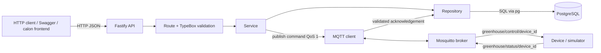

# Project Analysis — Greenhouse Lama

## Tujuan

Dokumen ini memetakan project greenhouse lama sebelum kita membangun ulang versi belajar dengan Laravel, Vue, PostgreSQL, MQTT, Mosquitto, dan Docker Compose.

Setelah membaca dokumen ini, saya diharapkan mampu:

1. Menjelaskan komponen yang benar-benar tersedia pada project lama.
2. Mengikuti alur request HTTP, operasi database, perintah MQTT, dan acknowledgement perangkat.
3. Membedakan teknologi project lama dari teknologi target pembelajaran.
4. Menunjukkan file yang bertanggung jawab pada setiap langkah.
5. Menjelaskan keterbatasan project lama dan urutan belajar ulang yang aman.

> Batas audit: dokumen ini dibuat dari source code dan konfigurasi pada branch `main`. Docker daemon tidak aktif ketika audit dilakukan, sehingga integration test belum dijalankan. Temuan runtime harus dikonfirmasi pada checkpoint terpisah.

## Metode Belajar

Setiap tahap berikutnya menggunakan pola:

```text
LEARN
  ↓
Pahami satu konsep dan alur datanya
  ↓
TRY
Tulis bagian kecil dengan tangan
  ↓
CHECK
Jalankan satu pengujian yang terarah
  ↓
COMPARE
Bandingkan dengan implementasi project lama
```

Project lama dipakai sebagai referensi keputusan desain, bukan sebagai kode yang disalin mentah.

## Ringkasan Audit

Project ini adalah **backend modular monolith**, bukan aplikasi Laravel dan bukan full-stack Vue.

| Area | Implementasi yang ditemukan | Status |
| --- | --- | --- |
| Backend | Node.js 22, TypeScript, Fastify | Ada |
| Frontend | Tidak ada source Vue atau frontend lain | Belum ada |
| Database | PostgreSQL 17, SQL melalui package `pg` | Ada |
| ORM | Tidak ada; query SQL ditulis di repository | Tidak ada |
| MQTT client | Package `mqtt` | Ada |
| MQTT broker | Eclipse Mosquitto 2.0 | Ada |
| Container | Multi-stage Dockerfile untuk API | Ada |
| Orkestrasi lokal | Docker Compose: API, PostgreSQL, Mosquitto | Ada |
| REST API | Fastify dengan 3 endpoint bisnis/health dan Swagger UI | Ada |
| Authentication/authorization | Tidak ditemukan | Belum ada |
| Testing | Vitest integration test dan script uji MQTT | Ada |
| Sensor MQTT ingestion | Tidak ditemukan; sensor masuk lewat HTTP | Belum ada |
| Soil moisture | Tidak ada pada schema/API/database | Belum ada |

Konsekuensi untuk pembelajaran: konsep bisnis dan alur data dapat dibandingkan, tetapi syntax/framework akan diterjemahkan dari Fastify/TypeScript ke Laravel/PHP. Vue akan dibangun sebagai komponen baru setelah REST API dasar dipahami.

## Struktur Project

```text
backend-greenhouse-assignment/
├── src/
│   ├── server.ts                  # entry point proses API
│   ├── app.ts                     # membangun Fastify dan mendaftarkan plugin/route
│   ├── config/env.ts              # membaca serta memvalidasi environment
│   ├── db/
│   │   ├── pool.ts                # connection pool PostgreSQL
│   │   ├── migrate.ts             # menjalankan semua file SQL berurutan
│   │   └── errors.ts              # error khusus operasi database
│   ├── mqtt/client.ts             # koneksi, publish, subscribe, reconnect, shutdown
│   ├── plugins/error-handler.ts   # bentuk respons error HTTP terpusat
│   └── modules/
│       ├── sensor/                # route → schema → service → repository
│       ├── device/                # kontrol device dan acknowledgement
│       └── health/                # pemeriksaan PostgreSQL dan MQTT
├── migrations/
│   ├── 001_init.sql
│   └── 002_device_acknowledgement.sql
├── deployments/mosquitto/
│   └── mosquitto.conf
├── scripts/test-mqtt.ts
├── tests/api.integration.test.ts
├── compose.yaml
├── Dockerfile
├── package.json
├── tsconfig.json
└── .env.example
```

Folder `dist/` dan `node_modules/` adalah hasil build/dependency lokal, bukan source utama yang dipelajari.

## Architecture

### Arsitektur aktual



Hal yang **tidak boleh digambar sebagai arsitektur saat ini**:

- Sensor tidak publish pembacaan ke MQTT.
- Tidak ada Vue dashboard.
- Tidak ada endpoint untuk membaca histori sensor.
- Tidak ada service Laravel.

### Pola internal backend

```text
Route
  ↓
Schema validation
  ↓
Service / business flow
  ↓
Repository atau MQTT adapter
  ↓
PostgreSQL / Mosquitto
```

Ini lebih berlapis daripada versi belajar pertama. Versi Laravel sederhana akan dimulai dari:

```text
Route → Controller → Eloquent Model → PostgreSQL
```

Service/repository baru dibahas setelah alur dasar dipahami dan ada kebutuhan nyata untuk memisahkannya.

## Backend

Backend menggunakan Node.js dengan TypeScript strict mode dan Fastify. Entry point ada di `src/server.ts`.

Urutan startup:

```text
Muat environment ketika module di-import
  ↓
Uji PostgreSQL dengan SELECT 1
  ↓
Jalankan file migration .sql secara alfabetis
  ↓
Mulai MQTT client dan subscription
  ↓
Bangun Fastify app, plugin, error handler, dan routes
  ↓
Listen pada HOST:PORT
```

Urutan shutdown ketika menerima `SIGINT` atau `SIGTERM`:

```text
Tutup Fastify
  ↓
Tutup MQTT client
  ↓
Tutup PostgreSQL pool
  ↓
Keluar dari proses
```

### Dependency backend utama

| Dependency | Fungsi |
| --- | --- |
| `fastify` | HTTP server dan routing |
| `@sinclair/typebox` | Schema request dan type TypeScript |
| `@fastify/swagger`, `@fastify/swagger-ui` | OpenAPI dan UI dokumentasi |
| `@fastify/rate-limit` | Batas global 100 request/menit |
| `pg` | PostgreSQL connection pool dan query |
| `mqtt` | MQTT client untuk publish/subscribe |
| `dotenv` | Membaca `.env` |
| `vitest` | Integration test |
| `tsx`, `typescript` | Development runtime dan compiler |

## Frontend

Tidak ditemukan `package.json` frontend, file `.vue`, konfigurasi Vite frontend, atau service Compose untuk Vue. Swagger UI pada `/docs` adalah UI dokumentasi API yang disediakan plugin, bukan dashboard greenhouse.

Implikasi:

- Vue bukan bagian yang dapat disalin atau dibandingkan secara langsung.
- Kita harus menentukan kebutuhan dashboard dari kontrak API.
- Project lama belum mempunyai read API, sehingga dashboard belum dapat mengambil histori sensor.
- Vue dipelajari setelah backend sederhana dapat mengembalikan JSON melalui endpoint GET.

## Database

Database menggunakan PostgreSQL 17 Alpine. Aplikasi terhubung melalui connection pool `pg` dengan maksimum 10 koneksi, idle timeout 30 detik, dan connection timeout 5 detik.

### Tabel `sensor_readings`

| Kolom | Makna |
| --- | --- |
| `id` | UUID pembacaan |
| `device_id` | identitas sensor, maksimum 128 karakter |
| `temperature` | suhu, dibatasi -50 sampai 100 |
| `humidity` | kelembapan, dibatasi 0 sampai 100 |
| `recorded_at` | waktu pembacaan pada sumber/event |
| `created_at` | waktu record dibuat oleh aplikasi |

Index mendukung pencarian terbaru berdasarkan device dan pencarian terbaru secara global. Tidak ada kolom `soil_moisture`.

### Tabel `device_commands`

Menyimpan intent dan lifecycle perintah dengan status:

```text
PENDING → PUBLISHED → EXECUTED
    └──────────────→ FAILED
```

`PUBLISHED` berarti callback publish MQTT berhasil, bukan bukti perangkat sudah mengeksekusi perintah. Bukti eksekusi datang melalui acknowledgement dan menghasilkan status `EXECUTED`.

### Migration

`src/db/migrate.ts` membaca seluruh file `.sql`, mengurutkannya berdasarkan nama, lalu menjalankannya ketika aplikasi startup. DDL memakai operasi seperti `IF NOT EXISTS`, tetapi belum ada migration history table, rollback, locking, atau transaksi lintas seluruh rangkaian migration.

## MQTT

MQTT hanya dipakai untuk kontrol perangkat dan acknowledgement.

### Topic aktual

| Arah | Topic | Pelaku |
| --- | --- | --- |
| API → device | `greenhouse/control/{device_id}` | backend publish, device subscribe |
| Device → API | `greenhouse/status/{device_id}` | device publish, backend subscribe melalui `greenhouse/status/+` |
| Compose healthcheck | `greenhouse/healthcheck` | `mosquitto_pub` lokal |

Semua pesan bisnis menggunakan QoS 1 dan publish memakai `retain: false`. MQTT client memakai clean session, timeout koneksi 5 detik, serta mencoba reconnect setiap 2 detik.

### Payload command aktual

Payload berisi `command_id`, `request_id`, `device_id`, `command`, dan `issued_at`. Nilai command hanya `ON` atau `OFF`.

### Payload acknowledgement aktual

Payload berisi `command_id`, `device_id`, status literal `EXECUTED`, dan `executed_at`. Backend memvalidasi:

- pola topic;
- format UUID command;
- kecocokan `device_id` dengan suffix topic;
- nilai status;
- timestamp;
- keberadaan command aktif di database.

Update acknowledgement bersifat idempotent untuk command yang sama karena `executed_at` menggunakan `COALESCE`.

### Perbedaan dari target akhir

Topic contoh pembelajaran sensor seperti `greenhouse/sensor/001/temperature` belum digunakan. Target akhir memerlukan alur tambahan:

```text
Sensor simulator
  ↓ publish pembacaan
Mosquitto
  ↓ subscription
Laravel MQTT consumer
  ↓ decode + validation
PostgreSQL
```

Kita akan membuat alur itu setelah konsep broker, publisher, subscriber, topic, payload, QoS, retained message, client ID, connection, dan disconnect dipahami.

## Mosquitto

Mosquitto berjalan sebagai broker dari image `eclipse-mosquitto:2.0` pada port 1883. Konfigurasi lokal:

- listen pada semua interface container;
- anonymous access diaktifkan;
- persistence dimatikan;
- log dikirim ke stdout;
- connection messages diaktifkan.

Konfigurasi ini sederhana dan berguna untuk belajar lokal, tetapi bukan konfigurasi production karena tidak memakai authentication, ACL, TLS, atau persistence broker.

## Docker

### Dockerfile API

Dockerfile memakai dua stage:

1. `builder`: install semua dependency, copy source/migration, lalu compile TypeScript.
2. `runner`: install production dependency saja, copy hasil build dan migration, berjalan sebagai user `node`, expose port 8080.

### Docker Compose

| Service | Image/build | Port host | Peran |
| --- | --- | ---: | --- |
| `postgres` | `postgres:17-alpine` | 5432 | penyimpanan data |
| `mosquitto` | `eclipse-mosquitto:2.0` | 1883 | MQTT broker |
| `api` | build dari Dockerfile | 8080 | REST API dan MQTT client |

`api` menunggu healthcheck PostgreSQL dan Mosquitto. Volume bernama `postgres_data` menjaga data database ketika container dihentikan. Konfigurasi Mosquitto di-mount read-only.

Tidak ada service frontend dan tidak ada custom network eksplisit; Compose memakai default network.

## API

| Method | Path | Input | Output utama | Dependency |
| --- | --- | --- | --- | --- |
| `POST` | `/sensor-data` | `device_id`, `temperature`, `humidity`, opsional `recorded_at` | 201 + reading | PostgreSQL |
| `POST` | `/device-control` | `device_id`, `command` | 200 + status publish | PostgreSQL + MQTT |
| `GET` | `/status` | tidak ada | 200/503 + status dependency | PostgreSQL + MQTT |
| `GET` | `/docs` | tidak ada | Swagger UI | Fastify |

Tidak ada prefix `/api`, endpoint GET histori sensor, update/delete sensor, device registry, atau endpoint autentikasi.

### Validation dan error

Fastify/TypeBox menolak missing field, tipe salah, nilai di luar range, field tambahan, dan `device_id` yang dapat menyuntikkan separator/wildcard topic. Type coercion dimatikan.

Error handler menyatukan respons untuk validation (400), malformed JSON (400), not found (404), payload terlalu besar (413), rate limit (429), dependency unavailable (503), dan error tak dikenal (500).

## Data Flow

### 1. Menyimpan pembacaan sensor — alur aktual

```text
INPUT
HTTP POST /sensor-data
  ↓
PROCESS
Fastify route → TypeBox validation → sensor service
→ bentuk UUID dan timestamp → sensor repository → INSERT SQL
  ↓
OUTPUT
PostgreSQL row + HTTP 201 JSON
```

Perhatikan bahwa Mosquitto tidak terlibat dalam alur ini.

### 2. Mengirim perintah perangkat

```text
INPUT
HTTP POST /device-control
  ↓
PROCESS
Route → validation → device service
→ simpan PENDING ke PostgreSQL
→ publish ke greenhouse/control/{device_id}
→ ubah status menjadi PUBLISHED atau FAILED
  ↓
OUTPUT
Pesan MQTT untuk device + HTTP JSON untuk client
```

### 3. Menerima acknowledgement perangkat

```text
INPUT
Device publish ke greenhouse/status/{device_id}
  ↓
PROCESS
Mosquitto → MQTT client → parse dan validasi payload/topic
→ repository mencocokkan command → status EXECUTED
  ↓
OUTPUT
Record PostgreSQL diperbarui; tidak ada push ke frontend
```

### 4. Health check

```text
INPUT
GET /status
  ↓
PROCESS
SELECT 1 ke PostgreSQL + baca state koneksi MQTT
  ↓
OUTPUT
HTTP 200 jika keduanya up, selain itu HTTP 503
```

## Important Files

### `src/server.ts`

- **Fungsi:** entry point, startup dependency, migration, listener HTTP, graceful shutdown.
- **Dipanggil oleh:** script `dev` atau `start`.
- **Berhubungan dengan:** environment, database, migration, MQTT client, dan app builder.
- **Input:** environment variables dan process signals.
- **Output:** proses server yang listen atau exit jika startup gagal.

### `src/app.ts`

- **Fungsi:** membuat instance Fastify serta mendaftarkan Swagger, rate limit, error handler, dan routes.
- **Dipanggil oleh:** `src/server.ts`.
- **Berhubungan dengan:** semua module route.
- **Input:** konfigurasi dari environment.
- **Output:** Fastify instance yang siap listen/test.

### `src/config/env.ts`

- **Fungsi:** membaca `.env`, memberi default, dan memastikan variable wajib tersedia.
- **Dipanggil oleh:** database, MQTT, server, dan app.
- **Input:** `process.env`.
- **Output:** object konfigurasi bertipe konsisten.

### `src/modules/sensor/sensor.route.ts`

- **Fungsi:** menerima `POST /sensor-data` dan membentuk respons 201.
- **Dipanggil oleh:** registrasi route di `src/app.ts`.
- **Berhubungan dengan:** sensor schema dan sensor service.
- **Input:** JSON pembacaan sensor.
- **Output:** JSON reading yang sudah disimpan.

### `src/modules/sensor/sensor.schema.ts`

- **Fungsi:** mendefinisikan field, tipe, pola, range, dan larangan field tambahan.
- **Dipanggil oleh:** sensor route/Fastify validation.
- **Input:** request body yang belum dipercaya.
- **Output:** request diterima atau validation error.

### `src/modules/sensor/sensor.service.ts`

- **Fungsi:** membuat UUID/timestamp dan memetakan format input-domain-response.
- **Dipanggil oleh:** sensor route.
- **Berhubungan dengan:** sensor repository.
- **Input:** data yang lolos schema.
- **Output:** representasi sensor reading untuk respons.

### `src/modules/sensor/sensor.repository.ts`

- **Fungsi:** menjalankan parameterized `INSERT` ke `sensor_readings`.
- **Dipanggil oleh:** sensor service.
- **Berhubungan dengan:** PostgreSQL pool dan database error.
- **Input:** entity sensor reading.
- **Output:** `void` atau typed database error.

### `src/modules/device/device.route.ts`

- **Fungsi:** menerima kontrol device dan menentukan request ID.
- **Dipanggil oleh:** `src/app.ts`.
- **Berhubungan dengan:** device schema dan service.
- **Input:** `device_id`, `command`, opsional header `x-request-id`.
- **Output:** HTTP 200 dengan hasil publish.

### `src/modules/device/device.service.ts`

- **Fungsi:** mengatur lifecycle PENDING/publish/PUBLISHED/FAILED.
- **Dipanggil oleh:** device route.
- **Berhubungan dengan:** repository dan MQTT adapter.
- **Input:** command tervalidasi dan request ID.
- **Output:** metadata command atau error.

### `src/modules/device/device-acknowledgement.service.ts`

- **Fungsi:** parse dan validasi acknowledgement lalu menandai command EXECUTED.
- **Dipanggil oleh:** event `message` MQTT.
- **Berhubungan dengan:** device repository.
- **Input:** topic dan raw `Buffer` MQTT.
- **Output:** update database atau rejection yang dicatat di log.

### `src/mqtt/client.ts`

- **Fungsi:** koneksi broker, subscribe status, publish command, reconnect, dan disconnect.
- **Dipanggil oleh:** server startup/shutdown dan device service.
- **Berhubungan dengan:** acknowledgement service.
- **Input:** MQTT URL/credentials, topic, string payload.
- **Output:** event MQTT atau `MqttUnavailableError`.

### `migrations/*.sql`

- **Fungsi:** membuat tabel/index/constraint dan menambah lifecycle acknowledgement.
- **Dipanggil oleh:** migration runner saat startup.
- **Input:** koneksi PostgreSQL.
- **Output:** schema database.

### `compose.yaml`

- **Fungsi:** menggabungkan API, PostgreSQL, dan Mosquitto untuk environment lokal.
- **Dipanggil oleh:** Docker Compose CLI.
- **Input:** `.env`, Dockerfile, dan config Mosquitto.
- **Output:** tiga container serta satu volume database.

### `tests/api.integration.test.ts`

- **Fungsi:** menguji health, sensor storage/validation, error envelope, MQTT command/ack, 404, dan rate limit.
- **Dipanggil oleh:** `npm test`.
- **Input:** stack yang sedang berjalan.
- **Output:** hasil Vitest; test juga menulis data test ke PostgreSQL.

## Environment Variables

| Variable | Pemakai | Tujuan |
| --- | --- | --- |
| `DATABASE_URL` | API | PostgreSQL connection string; wajib |
| `MQTT_URL` | API | broker URL; wajib |
| `HOST`, `PORT` | API | bind address dan port |
| `NODE_ENV` | API | mode runtime |
| `MQTT_CLIENT_ID` | MQTT client | identitas client; ada default berbasis PID |
| `MQTT_USERNAME`, `MQTT_PASSWORD` | MQTT client | credential opsional |
| `LOG_LEVEL` | Fastify | tingkat logging |
| `POSTGRES_DB`, `POSTGRES_USER`, `POSTGRES_PASSWORD` | Compose/PostgreSQL | bootstrap database container |

`TEST_API_URL` dan `TEST_MQTT_URL` juga dibaca oleh script/test sebagai override, walaupun tidak tercantum di `.env.example`.

Nilai rahasia tidak dicatat di dokumen ini. File `.env` diabaikan Git dan `.env.example` menjadi daftar konfigurasi yang aman dibagikan.

## Authentication

Tidak ditemukan middleware, token, session, user table, role, atau authorization rule. Akibatnya, setiap client yang dapat mencapai API dapat mencoba menyimpan sensor reading dan mengirim command perangkat.

Authentication tidak akan ditambahkan pada versi belajar awal karena akan mengaburkan alur Route → Controller → Model. Topik ini ditempatkan setelah API utama dipahami.

## Testing yang Tersedia

Integration test mencakup:

- health API/PostgreSQL/MQTT;
- penyimpanan sensor valid;
- field hilang, tipe salah, dan range salah;
- malformed JSON dan body lebih dari 1 MiB;
- publish command dan acknowledgement sampai database `EXECUTED`;
- pencegahan topic injection;
- pembacaan duplikat sebagai event terpisah;
- structured 404;
- global rate limit.

Belum ditemukan unit test terpisah, test frontend, test autentikasi, test sensor MQTT ingestion, atau test `soil_moisture`.

## Current Problems dan Batasan

Ini adalah hasil audit, bukan instruksi untuk langsung memperbaiki semuanya.

1. **Stack berbeda dari target belajar.** Project lama memakai Fastify/TypeScript, bukan Laravel/PHP.
2. **Frontend belum ada.** Tidak tersedia dashboard Vue maupun read API yang dibutuhkannya.
3. **Sensor hanya masuk lewat HTTP.** Target akhir MQTT sensor ingestion belum diimplementasikan.
4. **Model data belum mencakup soil moisture.** Schema, SQL, dan test hanya suhu/kelembapan.
5. **Tidak ada authentication/authorization.** Endpoint kontrol perangkat terbuka bagi client yang dapat mengakses API.
6. **Mosquitto hanya aman untuk lokal.** Anonymous access aktif; TLS, ACL, dan persistence tidak ada.
7. **Ada dual-write PostgreSQL/MQTT.** Publish bisa berhasil tetapi update `PUBLISHED` gagal; kegagalan update `FAILED` juga dapat menutupi error MQTT awal.
8. **Migration runner sederhana.** Tidak ada ledger, rollback, locking, atau deployment migration step terpisah.
9. **Tidak ada GET/history API.** Data tersimpan tetapi belum tersedia untuk dashboard.
10. **Observability dasar.** Ada log dan health, belum ada metrics, tracing, alert, atau pending-command age.
11. **Dokumentasi lama mengalami drift.** `DESIGN_EXPLANATION.md` masih menyebut acknowledgement tidak tersedia, padahal source dan migration saat ini sudah mendukung `EXECUTED`. Dokumen itu juga menjelaskan migration seolah hanya satu file/hardcoded, sedangkan runner saat ini membaca semua `.sql` secara alfabetis.
12. **Runtime belum diverifikasi dalam audit ini.** Docker daemon tidak aktif, sehingga status health dan integration test aktual belum dikonfirmasi.

## KNOWN

Hal yang sudah ada dan perlu saya pahami:

- lifecycle aplikasi: startup, listen, graceful shutdown;
- HTTP route, request, response, dan status code;
- strict schema validation;
- pemisahan route, schema, service, repository;
- PostgreSQL connection pool dan parameterized query;
- table, constraint, index, timestamp, dan UUID;
- migration SQL saat startup;
- MQTT broker, publisher, subscriber, topic wildcard, payload;
- QoS 1, non-retained message, reconnect, client ID;
- command state `PENDING → PUBLISHED → EXECUTED/FAILED`;
- acknowledgement validation dan idempotent update;
- error handling terpusat;
- healthcheck, rate limit, dan body limit;
- Docker multi-stage build, Compose dependency, volume, port, dan healthcheck;
- integration testing lintas API, database, dan broker;
- Git branch `main`, commit, status, diff, dan checkpoint.

## TO LEARN

Hal yang belum tersedia atau perlu dibangun secara bertahap:

- PHP dan struktur dasar Laravel;
- route, controller, Request, response JSON, dan Artisan;
- Laravel validation;
- migration dan Eloquent model;
- CRUD/read API untuk dashboard;
- menerjemahkan business flow lama tanpa menyalin abstraksinya;
- dasar MQTT dari publisher/subscriber sederhana;
- sensor simulator untuk temperature, humidity, dan soil moisture;
- Laravel MQTT subscriber/worker;
- validation payload sensor MQTT dan penyimpanan PostgreSQL;
- Vue component, props, state, event, lifecycle;
- API request, loading state, dan error state di Vue;
- dashboard sederhana dan integrasi Vue–Laravel;
- Docker image Laravel dan Vue;
- Compose service secara bertahap;
- authentication/authorization setelah flow utama dipahami;
- reliability problem seperti idempotency dan outbox setelah versi sederhana bekerja.

## Simple Learning Version vs Existing Project

### Simple Learning Version

Kita mulai dengan alur minimal:

```text
HTTP request → Laravel Route → Controller → Eloquent Model → PostgreSQL
```

Setelah itu baru MQTT:

```text
Simulator → Mosquitto → Laravel consumer → validation → Model → PostgreSQL
```

### Existing Project

Project lama memakai:

```text
Fastify Route → TypeBox Schema → Service → Repository → PostgreSQL/MQTT
```

### Difference

- framework dan bahasa berbeda;
- project lama sudah memisahkan service/repository;
- project lama mengirim command melalui MQTT, tetapi tidak menerima data sensor MQTT;
- target belajar menambah Vue, read API, soil moisture, dan sensor simulator.

### Why?

Lapisan project lama memisahkan HTTP, business flow, dan persistence sehingga perubahan lebih terisolasi. Namun, meniru semua lapisan sejak latihan pertama akan menambah beban konsep. Kita memahami jalur minimal lebih dahulu, lalu membandingkan kapan pemisahan tersebut memberi manfaat.

## Learning Roadmap

Urutan dipertahankan dekat dengan roadmap target, dengan penyesuaian dari hasil audit.

| Phase | Fokus | Exercise kecil | Compare dengan project lama |
| ---: | --- | --- | --- |
| 0 | Audit project | jelaskan tiga data flow aktual | dokumen ini |
| 1 | Laravel basics | jalankan satu response sederhana | Fastify bootstrap |
| 2 | Routing | buat satu route GET | `*.route.ts` |
| 3 | Controller | pindahkan handler ke controller | route handler lama |
| 4 | Request/response HTTP | JSON dan status code | envelope API lama |
| 5 | Validation | validasi satu field sensor | TypeBox schema |
| 6 | PostgreSQL | koneksi dan query konsep dasar | `pg` pool |
| 7 | Migration | buat tabel sensor minimal | SQL migrations lama |
| 8 | Eloquent model | simpan satu reading | repository lama |
| 9 | CRUD API | create dan read dahulu | POST lama; GET belum ada |
| 10 | API testing | happy path lalu validation error | Vitest integration test |
| 11 | MQTT concepts | publish/subscribe manual | topic control/status lama |
| 12 | Mosquitto | broker minimal lokal | config Mosquitto lama |
| 13 | MQTT pub/sub | kirim satu payload dummy | MQTT client lama |
| 14 | Laravel + MQTT | consumer membaca lalu log payload | acknowledgement handler lama |
| 15 | Sensor simulator | publish 3 nilai sensor | fitur baru; test script sebagai referensi pola |
| 16 | Vue basics | component dengan data statis | tidak ada pembanding lama |
| 17 | Vue + Laravel | fetch endpoint GET | kontrak JSON backend |
| 18 | Dashboard | loading/error/list sederhana | fitur baru |
| 19 | Docker basics | containerize satu service | multi-stage Dockerfile lama |
| 20 | Docker Compose | PostgreSQL dahulu, lalu broker/backend/frontend | Compose lama |
| 21 | Integrasi | sensor → MQTT → DB → API → Vue | perluasan arsitektur lama |
| 22 | Comparison | petakan Laravel terhadap Fastify | seluruh project lama |
| 23 | Improvement | auth, idempotency, outbox, observability | known limitations lama |

Prinsip setiap phase:

```text
1 concept → 1 implementation kecil → 1 test → 1 checkpoint
```

## Langkah Belajar Pertama

Sebelum menulis Laravel, lakukan walkthrough project lama:

1. Mulai dari `src/server.ts`, lalu ikuti import ke `src/app.ts`.
2. Pilih `POST /sensor-data` dan ikuti route → schema → service → repository → SQL.
3. Pilih `POST /device-control` dan ikuti database → MQTT → database.
4. Ikuti pesan balik dari `greenhouse/status/+` sampai status `EXECUTED`.
5. Cocokkan tabel dengan migration.
6. Cocokkan service Compose dengan hostname pada environment.

Belum ada file aplikasi yang perlu diubah pada langkah ini.

## Think

Sebelum coding, jawab dengan kata-kata sendiri:

1. Mengapa sensor reading saat ini tidak melewati Mosquitto?
2. Apa perbedaan `PUBLISHED` dan `EXECUTED`?
3. Mengapa command disimpan sebagai `PENDING` sebelum publish MQTT?
4. Siapa yang memvalidasi HTTP payload, dan siapa yang memvalidasi acknowledgement MQTT?
5. Mengapa `device_id` tidak boleh berisi `/`, `+`, atau `#`?
6. Apa beda `recorded_at` dan `created_at`?
7. Mengapa repository memakai parameter `$1`, `$2`, dan seterusnya?
8. Mengapa dashboard belum dapat menampilkan histori walaupun data sudah ada di PostgreSQL?
9. Apa risiko `allow_anonymous true`?
10. Bagian mana yang nanti digantikan oleh Laravel Route, Controller, validation, dan Eloquent?

## Coding Exercise

Belum ada exercise implementasi pada Phase 0. Exercise analisisnya adalah membuat sendiri dua diagram kecil tanpa melihat diagram di atas:

1. Alur `POST /sensor-data` sampai PostgreSQL.
2. Alur `POST /device-control` sampai acknowledgement `EXECUTED`.

Untuk setiap node, tulis nama file yang bertanggung jawab.

## Clue

### Clue 1

Mulai dari pencarian string path endpoint, bukan dari database.

### Clue 2

Import pada bagian atas file menunjukkan langkah berikutnya dalam alur.

### Clue 3

Pisahkan input HTTP dari pesan MQTT; keduanya punya validation boundary yang berbeda.

### Clue 4

Untuk command, amati perubahan nilai kolom `status`, bukan hanya respons HTTP.

### Clue 5

Jangan simpulkan fitur dari README saja; cocokkan dengan source, migration, dan test.

## Expected Result

Saya dapat menjelaskan tanpa membaca kode:

```text
Sensor HTTP client
→ Fastify route
→ schema validation
→ service
→ repository
→ PostgreSQL
```

dan:

```text
HTTP client
→ device route/service
→ PENDING di PostgreSQL
→ MQTT publish melalui Mosquitto
→ device
→ acknowledgement MQTT
→ EXECUTED di PostgreSQL
```

Saya juga dapat menyebutkan bahwa Vue, Laravel, sensor MQTT ingestion, GET history API, dan soil moisture belum ada pada project lama.

## Testing

Audit statis sudah mencocokkan route, schema, service, repository, migration, MQTT client, Compose, dan integration test.

Runtime verification yang dilakukan nanti, setelah Docker tersedia:

1. Pastikan working tree tetap bersih dengan `git status`.
2. Jalankan typecheck/build.
3. Jalankan stack Compose.
4. Periksa `/status`.
5. Jalankan integration test.
6. Amati satu pesan command dan satu acknowledgement.
7. Periksa record database yang dihasilkan.

Integration test menulis data dan rate-limit test mengirim banyak request, sehingga tindakan itu sengaja tidak dilakukan sebagai bagian audit read-only ini.

## Common Errors

| Error/gejala | Arti atau kemungkinan sebab | Cara investigasi awal |
| --- | --- | --- |
| `Missing environment variable` | `DATABASE_URL`/`MQTT_URL` tidak terbaca | bandingkan key `.env` dengan `.env.example` |
| API gagal startup | PostgreSQL belum dapat diakses atau migration gagal | lihat log API dan health PostgreSQL |
| `/status` menghasilkan 503 | database atau MQTT sedang down | baca field `database` dan `mqtt` pada respons |
| MQTT publish 503 | client belum tersambung/broker unavailable | periksa broker dan log reconnect |
| HTTP 400 validation | shape, tipe, range, atau field tambahan salah | baca `error.details` |
| Command tetap `PUBLISHED` | acknowledgement belum diterima/valid | periksa topic, `command_id`, `device_id`, timestamp |
| Docker hostname gagal dari host | nama `postgres`/`mosquitto` hanya berlaku di network Compose | gunakan `127.0.0.1` ketika API berjalan lokal |
| Migration tampak sudah jalan tetapi schema drift | runner tidak mempunyai migration ledger | bandingkan file SQL dengan schema aktual |

## Checkpoint

Jangan lanjut ke tutorial Laravel sebelum saya bisa menjawab:

1. Apa entry point project lama?
2. Apa tanggung jawab route, schema, service, dan repository?
3. Melalui protokol apa sensor reading masuk saat ini?
4. Untuk apa MQTT dipakai saat ini?
5. Apa fungsi Mosquitto?
6. Tabel apa saja yang ada dan data apa yang disimpan?
7. Mengapa `PUBLISHED` belum sama dengan `EXECUTED`?
8. Komponen target apa yang belum tersedia?
9. Apa batas keamanan konfigurasi lokal?
10. Mengapa kita tidak langsung menyalin service/repository ke versi Laravel pertama?

Status checkpoint:

```text
REVIEW — menunggu jawaban/pemahaman saya
```

## Hubungan dengan Project Lama

Dokumen ini adalah baseline pembanding. Pada setiap tutorial berikutnya kita akan memakai empat pertanyaan:

1. Bagaimana versi belajar sederhana melakukan tugas ini?
2. File mana pada project lama yang melakukan tugas setara?
3. Apa perbedaannya?
4. Mengapa project lama memilih struktur yang lebih kompleks atau berbeda?

Kita tidak menganggap seluruh dokumentasi lama selalu benar; source code, migration, dan test menjadi bukti utama ketika ada documentation drift.

## Next Step

Setelah checkpoint Phase 0 dinilai **PASS**, langkah berikutnya adalah `02-laravel-basics.md`: memahami lifecycle request Laravel dan membuat response paling kecil tanpa database, MQTT, Vue, atau Docker Compose terlebih dahulu.

Checkpoint Git yang disarankan sebelum tahap berikutnya:

```text
docs: add legacy project analysis
```

